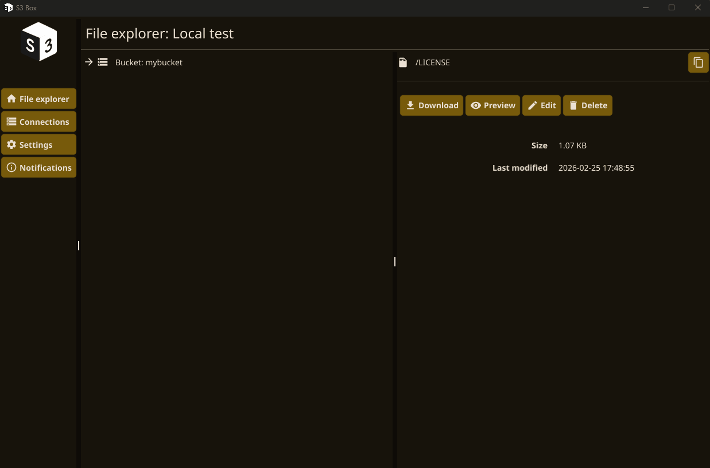
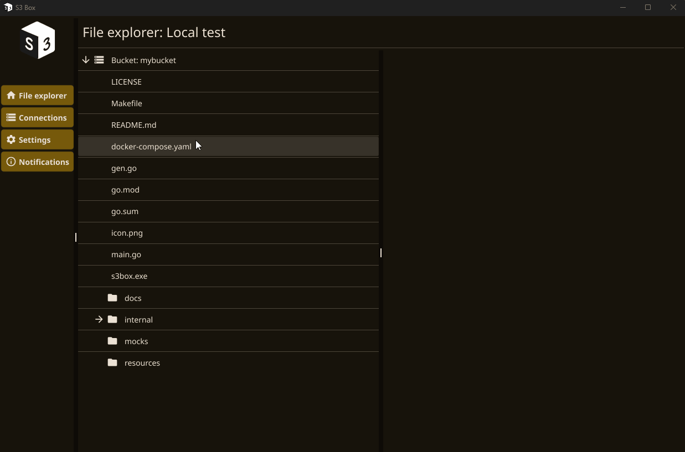

# s3-box

A simple desktop application for accessing s3 resources

## Features

* **A file explorer tree and a simple text editor**

* **Manage multiple connections to your buckets** from AWS or any S3-compatible storage

## Installation

### For Linux

**Requirements**

- `make`

**Process**

* Download the `*.tar.xz` file from the [releases page](https://github.com/thomas-marquis/s3-box/releases)
* Extract the archive
* Run `make user-install`
