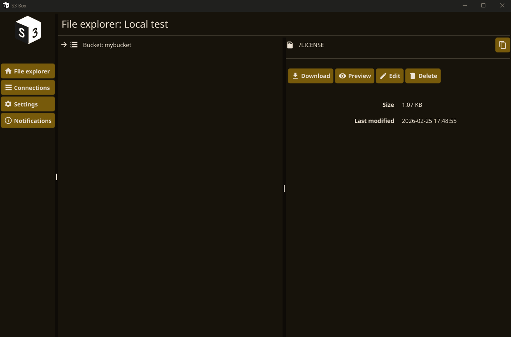
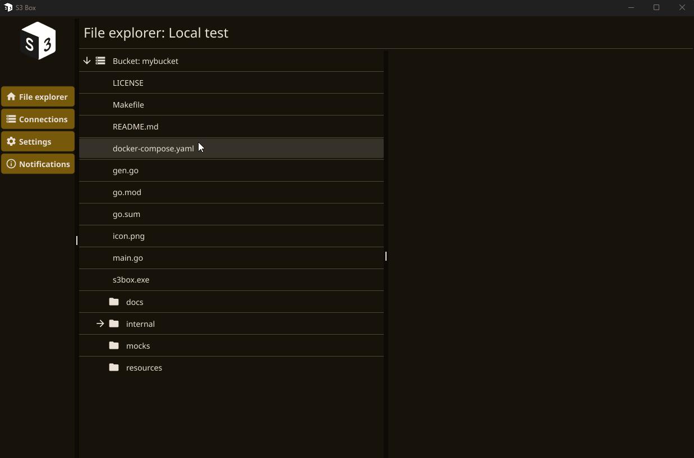

# S3-Box

  

A lightweight desktop application for seamless S3 objects management.

S3-Box is designed for anyone who needs quick, intuitive access to S3 buckets
—whether on AWS or any S3-compatible storage. 
With a clean interface and essential features, it simplifies browsing, editing, 
and managing your cloud storage directly from your desktop.

## Features

* **Intuitive File Explorer & Built-in Text Editor**

* **Connect to multiple S3 buckets or providers (AWS, MinIO, etc.) and switch between them effortlessly. Perfect for managing distributed storage or multi-cloud environments.**

* **Activate a read-only mode to be sure to don't break anything on critical buckets**

* **Rename a single file or a directory seamlessly**

**Warning**! Keep in mind this operation requires to rename all the keys under the directory
(actually, there is no notion of 'directory' in classical S3...). Fortunately, a recovery system is integrated to S3 Box
to resuming aborted or failed renaming.

## Installation and update

### Linux

**Requirements**

- `make`

**Process**

* Download the `*.tar.xz` file from the [releases page](https://github.com/thomas-marquis/s3-box/releases)
* Extract the archive (e.g. `tar -xf S3box-linux-amd64-*.tar.xz`)
* Run `make user-install`

Use the very same process to update the application. Your existing connections and settings will remain unchanged.

### Windows

**Requirements**

- ``

**Process**

*

## Contributing
If you're interested in contributing to S3-Box, whether it's reporting bugs, suggesting features, or submitting code, please read our [Contributing Guide](CONTRIBUTING.md) for more information.